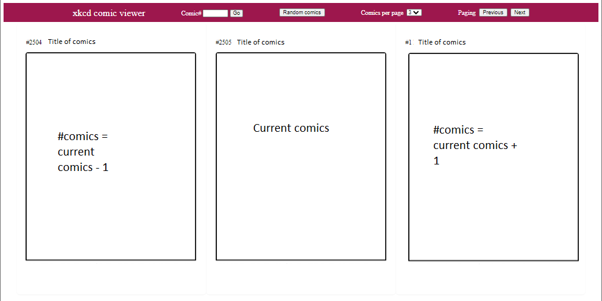

END OF MODULE PROJECT (CAPSTONE PROJECT)

<table>
    <thead> <tr><th>Project Title / Description</th>    <th>Implement a xkcd comic reader</th></tr> </thead>
    <tbody>
        <tr>
            <td>Project Objective(s)</td>
            <td>
                
xkcd.com is a webcomic site that provides its api as documented at https://xkcd.com/json.html

                
You can get the specific comics using the endpoints like below

                <ul>
                    <li>https://xkcd.com/1/info.0.json
                    <li>https://xkcd.com/600/info.0.json
                    <li>https://xkcd.com/2475/info.0.json
                </ul>
         
                
Create a custom website to display 3 comics with comic title, comic image, and 3 buttons above it (prev, random, next) to control what comics to show.
                
Something like below, with the difference that you need to show the comic before it and after it.
                    For example if the current image is image 200, then you should show image 199 on the left and image 201 on the right.
                    When the current image is the last image (2475), then show image 2474 on the left and image 1 on the right.

                
When the user clicks next/prev, the comics should change to next/prev 3 comics. For instance, 
                    if the current comics are comics 1, 2, and 3, comics 4, 5, 6 should be displayed.

                
To provide a good user experience, show a loading indicator while you make the API calls.

                
A text input and a “Go” button next to it should be displayed to allow the user to go to a specific comic number. 
                    If a user enters invalid value, an error message should be shown to indicate that the number is invalid.

                
A select element should be displayed to allow users to select showing 1, 3, or 5 comics at a time.

                
You are not allowed to use any third-party script/library for this project.
                    Only plain JavaScript and DOM API is allowed.

            </td>
        </tr>
        <tr>
            <td>Project Duration</td>
            <td>121 hours</td>
        </tr>
        <tr>
            <td>Mode of Delivery</td>
            <td>Group Consultation + Group Presentation</td>
        </tr>
        <tr>
            <td>Constraints:</td>
            <td>The https://xkcd.com/json.html API rejects fetch requests from Java scripts with CORS error.  The api at https://xkcd.vercel.app/ is used instead.
<ul>
    <li> Latest: https://xkcd.now.sh/?comic=latest</li>
    <li> Comic #303 (and so on...): https://xkcd.now.sh/?comic=303</li>
</ul></td>
        </tr>
    </tbody>
</table>

## User Requirements:
- Comics viewer opens with 3 pictures per page, where the current picture is the latest picture in the repository.
- User can use a selector to switch the page sizes between 1, 3 and 5.
- User can input a picture number to display that picture as current picture.
- User can click a button to randomly select current picture.
- User can click a next page and previous page button to move to the next page or previous page.
- When picture are being loaded, the scren shows 'Loading, please wait...'.

## Wireframe

